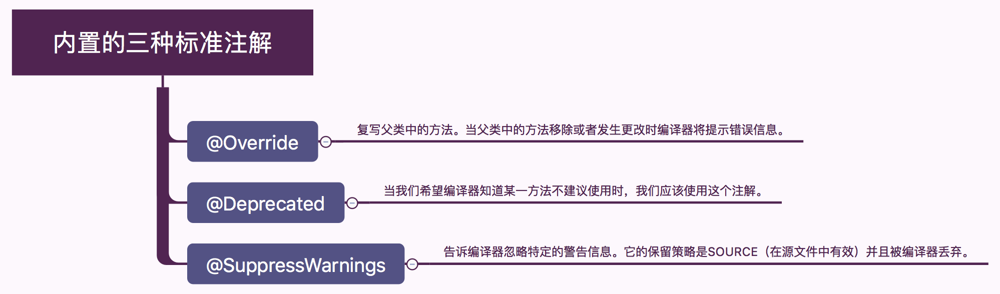
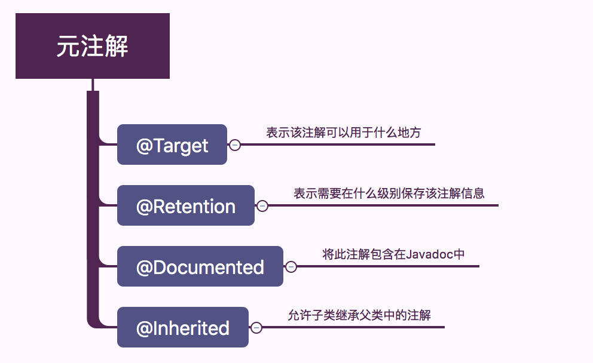

# 注解 @interface

## 创建一个注解类



```java
@Target(ElementType.METHOD)
@Retention(RetentionPolicy.RUNTIME)
public @interface UseCase {
    public int id();

    public String description() default "no description";
}
```



- @Retention
  >定义注解类的生命周期
  - @Retention(RetentionPolicy.SOURCE)
    >这个注解的意思是让MyAnnotation注解只在java源文件中存在，编译成.class文件后注解就不存在了
  - @Retention(RetentionPolicy.CLASS)
    >这个注解的意思是让MyAnnotation注解在java源文件(.java文件)中存在，编译成.class文件后注解也还存在，
  - @Retention(RetentionPolicy.RUNTIME)
    >注解的生命周期一直程序运行时都存在
- @Target
  >注释起作用的位置

|描述|作用|
|--|--|
|@Target(ElementType.TYPE)|接口、类、枚举、注解|
|@Target(ElementType.FIELD)|字段、枚举的常量|
|@Target(ElementType.METHOD)|方法|
|@Target(ElementType.PARAMETER)|方法参数|
|@Target(ElementType.CONSTRUCTOR)|构造函数|
|@Target(ElementType.LOCAL_VARIABLE)|局部变量|
|@Target(ElementType.ANNOTATION_TYPE)|注解|
|@Target(ElementType.PACKAGE)|包|

## 注解类的使用

```java
    public class PasswordUtils {
    @UseCase(id = 47, description =
            "Passwords must contain at least one numeric")
    public boolean validatePassword(String password) {
        return (password.matches("\\w*\\d\\w*"));
    }

    @UseCase(id = 48)
    public String encryptPassword(String password) {
        return new StringBuilder(password).reverse().toString();
    }

    @UseCase(id = 49, description =
            "New passwords can't equal previously used ones")
    public boolean checkForNewPassword(
            List<String> prevPasswords, String password) {
        return !prevPasswords.contains(password);
    }
}
```