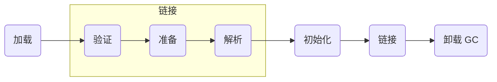

# Java

## JVM

### 1. 内存模型

- JVM内存模型

- JMM内存模型：定义程序中变量的访问规则

- JMM保证

**注：** volatile

> volatile:1.对变量的赋值会强制刷新到主内存，强制变量的读取会从主内存中重新加载。2.阻止指令重排序
  
#### 1.1、 程序计数器

#### 1.2、 方法区

#### 1.3、 堆/栈

#### 1.4、本地方法栈

### 2. 类加载机制

#### 2.1、类加载的流程

#### 2.2、双亲委派模式：

- BootStrap ClassLoader 启动类加载 --->  <JAVA_HOME>/lib
- ExtClassLoader 扩展加载器  --->  <JAVA_HOME>/lin/ext
- AppClassLoader 应用加载器   --->   java -classpath
- Custom ClassLoader 自定义类加载器

### 3. GC 垃圾回收

#### 3.1、分代回收

- 年轻代
- 老年代
- 永久代

#### 3.2、回收算法

- CMS 算法
- G1 算法
- ZGC

#### 3.3、FullGC的触发

- 年轻代晋升老年代空间不足
- 永久代空间不足

### 4. 性能调优

### 5. 编译器优化

### 6. 执行模式