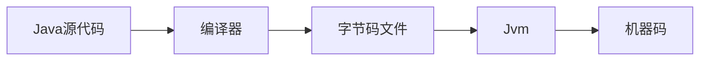

# ``Java知识总结``

## 2018-03-06

---

> - 1.类名要求与文件包名一致
> - 2.一个文件中只能有一个公共类，且文件名要与   公共类名一致
> - 3.println:下行换行
  printf:格式化输出  format
> - 4.注释：单行注释，多行注释，文档注释
> - 5.命名规范：驼峰
> - 6.packae（包）:
  类的集合
  避免冲突
  扩大保护
> - 7.关键字：被Java赋予特定功能意义的字符；关键字的字符都是小写；
> - 8.标识符：自己定义的名字；“命名规则”
> - 9.变量：先声明，再使用

## 10.数据类型

### 基本数据类型

> - 数值(byte<short<int<long)，
> - 浮点(float<double)-----0.0
> - 字符(char)-----空格
> - 布尔(boolean)-----false

### 引用数据类型

> - new 出来的都是引用数据类型，默认值为null , String

## 2018-03-07

---

> - 11.变量的初始化：右边赋值于左边；
>   强制类型转换： double j =9.99; int i  = (int) j;
> - 12.运算符：算数，赋值，关系，逻辑，位；
> - `三目运算符：`
> 条件?选项一:选项2（m > n ? m : n）

### 13.判断字符串是否相等：通过`存储位置`判断

>equals,   M.equals.(w)

### 14.方法 Method

>- 方法是解决一类问题的组合
>- 方法是包含在类/对象中
>- 方法在程序中创建，在其他地方调用

### `优点：`

>- 使代码更加简洁
>- 有利于代码的后期维护
>- 提高开发效率
>- 增加代码复用率，减少冗余

---

### `格式：`

>修饰符 返回类型 方法名(){
>
> 方法
>
> }

```java
 public static int f(){
    System.out.println();
}
 ```

- 修饰符：

> public , private , static

- 返回类型：

> void , int ,...；
> 有返回类型的必须通过return返回

- 方法名：首字母小写，小驼峰式命名
- 参数：由调用方传递给方法运行时处理的数据

## 2018-03-09

---

## 15.递归算法：调用自身算法

>```java
>  public static void test(){
>        test();
>}
>```

## 16.数组(引用数据类型)：用来存储`相同数据类型`的`多个`元素

> - 数组的声明： 元素类型[] 变量名;
> - 数组的初始化：
> 数组变量 = new 数据类型 [数据长度]

```java
 String[] arrStr = new String[3];
 ```

>- 数据变量 = {数据...}

```java
String[] arrStr2 = {"ASD","ZXC"};
```

>- 数组元素通过下标取值与修改

## 17.数据存储

### 栈区和堆区

> - 栈区存储：变量存储，先入后出；
> - 堆区存储：对象存储，分配存储；

## 18.数组排序

- 冒泡排序
- 插入排序
- 希尔排序
- 堆排序

## 2018-03-12

---

## 数组的增删改查

> - 根据下标操作；
> - 数组拷贝：arraycopy(原数组，原数组起始下标，目标数组，目标数组起始下标，目标数组拷贝长度)

```java
   System.arraycopy(arr1,0,arr2,0,arr1.length);
```

- `数组打印`

```java
1.
System.out.println(Arrays.toString(Str));
2.
for(int i = 0 ; i <arr.length; i++){
  System.out.println(arr[i]);
}
3.
/*for(数组数据类型  变量名 ：操作数组)*/
for(String str : arrStr){
  System.out.println(str);
}
```

>- 新增数组：
利用拷贝数组的方法

## 数组的扩容

>```java
>//新建一个比原数组长度大1的新数组
> int [] newArr = new int[count + 1];  
>  //进行数组拷贝
>  System.arraycopy(arr, 0, newArr, 0,arr.length);
> //将arr的引用指向newArr的对象
> arr = newArr;
>```

## 19. Array方法

- Arrays.fill() 对指定数组的每个元素，填充指定的值

```java
int[] arr = {1,5,6,5};
Arrays.fill(arr,10);
```

- Arrays.sort()对指定的数组进行升序排序
  
```java
int[] arr = {1,5,6,5};
Arrays.sort(arr);
```

- Arrays.binarySearch()从指定数组中查找指定的数组，返回元素下标位

```java
int[] arr = {1,5,6,5};
/*先对数组排序*/
Arrays.sort(arr);
int index = Arrays.binarySearch(arr,2);
```

## 20.二维数组

> `String[][] ArrStr = new String[][];`

```java
int[][] ArrInt = {4,55,7,8},{5,88,9,47},{4,8,21};
```

## 21.流程控制

### while语句

> - 1.定义开关
> - 2.计数器
> - 3.流程操作
> - 4.嵌套

## 2018-03-14

---

## 22.方法的重载  (Overload)

> - 在同一类中，具有相同方法名但是参数不同的方法。

### 参数不同

> - 参数的个数不同
> - 参数的类型不同
> - 类型相同，但顺序不同

```java
public class Demo{

  public static void Test(){
       ...
  }
  /*
   *  方法的重载
   */
  public static void Test(int i){
       ...
  }
}
```

## 方法调用规则

### 通过类名调用

> - 被`static`关键字修饰的方法

### static  关键字(静态)

>
java中一个修饰符,含义:静态方法上加上static,就是静态方法,这个方法就是属于这个类的属性(变量)上加stiaic,就是静态属性这个静态属性也是属于类的静态代码段
>加载器在加载class的时候,会自动加载static里的内容
>main方法直接运行静态的属性以及静态的方法也是属于类的

```java
static{
  ....
  }
```

```java
public class F{
  public static void cl(){
  ...
  }
}

F.cl();

```

### 通过对象调用

> - 没有static关键字修饰的方法

```java

public class E{
  public void cl(){
  ...
  }
}

E c = new E();
c.cl();
```

## 23. 面向对象

> - 面向对象主要是对象的构建，以类为单位，把功能封装在类中，以对象为载体。

- ## 对象  =  属性  + 行为

### 面向对象的三大特性

- 封装、继承、接口的多种不同的实现方式

### 类与对象

> - 类是对象的抽象化，是一个抽象概念。
> - 对象是类的实例化，是个具体概念。

### 定义类

> - 根据对象拥有的`属性和行为`进行定义。
> - 属性的定义：修饰符  数据类型  属性名（初值）

```java
class A{
  int aa;
 String bb;
}
```

> - 方法的定义（行为）

```java
void eat(){
  ...
}
```

## 变量类型

> - 局部变量
> - 实例变量
> - 类变量，也叫静态变量

## 构造方法（construct）

> - 没有返回类型
> - 方法名与类名相同
> - 支持重载

### 构造方法作用

> - 用来给成员变量（全局变量）赋值，满足创建对象的语法要求

```java
public class Ct{

  int i;
  String s;

  public Ct(int i,String s){
    ....
  }
}

```

## 对象的创建

> - 申请堆空间
> - 给属性赋初值
> - 调用构造方法

### 对象初始化后才能使用，否则会出现NullPointException[空指针异常]

> - 一个对象可以被多次引用
> - 引用在一段时间内只指向某一个对象
> - 使用new创建的对象一定不是同一个对象。

## 2018-03-15

---

## this关键字

> 1.构造方法中区分参数与成员变量  
> 2.调用同类的构造方法

```java
public class Person{
  String name;
  String gender;

  public Person(String name){
    this.name = name;
  }

  public Person(String name,String gender){
    this(name);
    this.gender = gender;
  }
}
```

### 访问修饰符

> - public
> - protected
> - default(默认)
> - private

## 24.封装

### 类的封装

> - 属性的私有化:
> 通过private 修饰
> - 为了增加属性的安全
> - 为了调用者存取属性，就要对属性提供对外公开的方法---get/set方法

### 方法的封装

> - 由于类的的属性和功能都是分开的,所以我们使用另一个策略来封装类的功能

### 垃圾回收机制 (GC)

>自动回收垃圾(没有引用的对象)
>GC清除出垃圾并不是程序可以掌控,只能通知GC回收垃圾
>GC是由JVM控制

## 25.继承（extends）

> 让子类快速获取父类代码

- 单继承
- 传递性
- 原始父类：Object类

### 判断两个对象的类型是否一致

> - 使用关键 instanceOf

 a instanceof B     a是B类型返回true,否则返回false

## `方法的重写`（override）

> - `具有父子类关系`，子类可以重写父类的方法

## 26.多态

> - 具有相同类型的对象，调用同一个方法时的不同表现。
> - 具有继承关系
> - 具有方法的重写   > - 方法名要一致
> - 参数要一致
> - 抛出的异常类型上限要是父类抛出的异常类型。
> - 子类的访问修饰符必须大于等于父类的
> - 子类的返回类型上限是父类的返回类型

继承于同一父类的子类，具有与父类相同的方法，但是方法的具体表现不同。

## `父类引用指向子类对象`

> Animal dog = new Dog()
>
>- 父类引用创建对象，只能调用父类以及父类上级的方法。

## 2018-03-16

---

## 27.抽象类(abstract class)

> - 不能被实例化 (不能new)
> - 是用来`被继承`的(子类必须实现（重写）父类的所有抽象方法)
> - 可以创建构造方法、抽象方法、非抽象方法  

### 抽象方法

>```java
>public abstract class Animal{
>  .......
>  public abstract eat();
>}
>```
>
>没有具体的方法实现，直接以；结尾，拥有类无法实现该方法。
>
### 用于父类的方法设计

#### 面向过程编程/面向对象编程/面向接口编程

### final 关键字

> - 给变量加上final，则一旦赋值就不可以改变。
>   1.变量名全部大写;  
>   2.变量名有多个单词组成时，单词间以_分隔。
> - 类加上final就不被被继承
> - 方法加上final就不能被重写

## 28.接口（interface）

> - 一种完全抽象的数据类型

### 特点

> - 所有的属性都是公开的静态常量；
> - 所有方法都是公开的抽象方法；
> - 没有构造
> - 接口支持多继承
> - 一个类可以实现多个接口

```java
public interface Istudentable{

}

public void studentImpl >implements Istudentable(){

}
```

### 优点

> - 接口可以多实现，拓展性高
>

## 29.设计模式

### 1. 简单工厂设计模式

>提供一个工厂类，并依赖于某个接口，有公开，静态方法，返回接口的实例

### 2.单例模式

>
保证某各类在整个生命周期内只有一个唯一的实例

实现原理:

 1).首先要保证外部无法 new 到这个类的实例(构造方法私有化)

 2).其次,类自己只能new一次

 3).最后,把唯一的实例返回到外界

### 3.回调模式

#### 在方法体内部通过使用`接口类型的实例`去调用该接口的方法，要想获得接口首先要获得接口的实现类

>
>- 1.在这个方法存在的类中，将接口类型定义为一个属性
> - 2.在方法中传入目标接口作为参数

```java
//回调接口
public interface IcallBackable{
  void callBack();
}

//回调实现类
public class CallBackImpl implements IcallBackable{
  public void callBack(){
    ...
  }
}

//回调接口的使用类
public class Invoker {
  //将接口类型作为属性
  priavate IcallBackable icb;

  public void ocl(){
    icb.callBack();
  }
}

public class Invoker {
 //把接口作为参数
  public void ocl2(IcallBackable icbd){
    icb.callBack();
  }
}
```

### 反射

> - 运行时分析类的功能
> - 在运行时查看对象
> - 实现数组的操作代码
> - 利用Method对象

## 2018-03-19

---

## 30.常用类

### Object类

#### toString()

>- toString   返回对象字符串表现形式

#### clone()

>- 浅拷贝  
>  1.要克隆的类必须实现cloneable接口
>  2.必须重写clone()方法
>- 深拷贝  
>  1.必须要自己重新实现clone()方法  

#### getclass()

> - 返回运行时的类型

### String 类

> - String str = "";创建的字符串，会存放在“串池”

#### charArt()

> - 返回指定下标的字符9

#### length()

> - 返回字符串的字符个数

```java
for(int i = 0;i<str.length();i++){
  System.out.println(str.charArt(i));
}
```

#### endWith()

> - 判断是否以指定字符结尾

#### indexOf()

> - 返回指定字符串中第一次出现的索引位置（也就是下标位）

#### isempty()

> - 判断字符串的长度是否为0

#### lastindexOf()

> - 指定字符最后出现的下标

#### split

> - 指定字符截取

```java
String str = "a:b:c";
String strs = str.split(":");

----> Show:n/n [a,b,c]
```

#### substring()

> - 指定位置截取字符串

#### StringBuilder

> - 字符串的拼接

```java
StringBuilder sb = new StringBuilder("AA");
sb.append("BB").append("CC");

----Show: AABBCC
```

> - delete(in start,int end)--移除子字符串的指定内容（deleteCharAt1）
> - insert(int index,String str)---在指定位插入字符串

#### 字符串解码和编码的操作

字符与字节码之间的转换

```java
String name = "Megen";
Byte[] b1 = name.getByte();

String s1 = new String(b1);
```

## 2018-03-20

---

## Math类

### abs() 绝对值

### ceil()   向上取整

### floor()  向下取整

### min() / max() 最值

### NumberFormat 数字格式化

### Date类

> - 计算机存储时间以1970年1月1日8：00开始计时的毫秒数

```java
Date d = new Date();
```

#### Calender

## 31. 异常

> - 一种“信号”的传递机制

### 分类

> - `运行时异常`，也叫做未检查异常。直接或间接继承于RuntimeException
> 1.NullPointerException  空指针异常；
> 2.ClassCastException 类型转换异常；

### 都是在JVM内部造成的，是代码编写问题

> - `非运行时异常`，也叫已检查异常直接或间接继承于Exception。
> 1.IOException  io异常

### JVM外部造成的，需要对异常进行处理

> - 消极处理：throws  抛出异常
public void method() throws IOException{
  ...
}

```java
/**
  *已知异常
  */
try{
...
}
catch(xxException e){
  //打印异常
  e.printStackTrace();
  //出现异常后，需要执行的补救措施
}
finally{
  //始终可以执行
...
}
```

> - 积极处理：使用try/catch

```java
/**
  *主动抓取可能出现的错误
  */
try{
...
}
catch(xxException e){
  //打印异常
  e.printStackTrace();
  
}
finally{
  //始终可以执行
...
}
//在try中System.exit();可以不运行finally中代码
```

> - 自定义异常
>
>     定义类继承Exceptin异常类，重写父类中的构造方法。

## 33.内部类

### 定义在类的内部的类，根据所处的位置不同房分为

#### 成员内部类

```java
public class Out{
  private int i;
  private Inner in;
  public Out(){
    this.inner  = new Inner();
  }
  private class Inner{
    ...
  }
}
```

> - 优点：
>  1.可以访问外部类的所有成员
>  2.对于外部类来说，封装性更好
> - 内部类调用外部类属性时：外部类.this.属性名
>
> ### 外部类实现继承，内部类调用接口

### 静态内部类

> - 加入static修饰的内部类

```java
public class Out{

  static class Inner{
    ...
  }
}
```

### 局部内部类

> - 定义在方法中内部类

```java
public class Out{

  public void jc(){

    class Inner{
    ...
    }
  }
}
```

### 匿名内部类

> - 同局部内部类，但是没有类名

```java
public class Out{

  public void jc(){
    Inner i = new Inner({
    @Overried
    public void mel(){
       ...
       }
    });
  }
}
```

## 2018-03-21

---

## 34.集合

### 容器类[Container]

> - 就是存放其他对象的对象
> - 有序存入，可重复

```java
List list = new ArrayList();
```

> - contains(Object o) 判断指定对象是否存在于集合中
> - containsAll(Collection c)判断集合是否存在于制定集合中。
> - get(int index) 获取指定位置的元素
> - size()获取集合元素的个数
> - indexOf()
> - remove()

### 遍历集合

> - 1.迭代器

```java
//迭代器
Iterator  it  = list.iterator()

while(it.hasNext()){
  if(it.next().equals("...")){
    it.remove();
  }
}
```

> - 2.增强for循环

```java
for(Object object : list){

}
```

> - 3.for循环
> - 集合中对同一对象的判断
重写hashCode 和 equals对象

### HashSet()方法

> - 无序存入，不可重复

```java
Set  set  = new HashSet();
```

### TreeSet()方法

> - 自定义对象排序  comparable接口

### Collections 集合工具类

> - Collections.add(List l,Object a,Object c);
> - Coolections.sort(List a);

### Map 映射

> - 存储方式：Key——Value
> - put（key,value）添加

## 2018-03-21 PM

---

## 35.泛型

> - 主动约束“容器”存放的数据类型

### 泛型语法

> - 泛型<泛型字母>
> - 泛型类：

```java
public class Box<T>{
  private int id;
  private T t;
  ...
}

public class TestBox{

  public void test(){

  Box<String>  box =  new Box<>(int,String);

  }
}
```

#### 泛型是不存在多态的

> 自定义泛型方法：

- 修饰符 `<T>` 返回类型 方法名（参数） throws 异常{
  方法体

}

泛型通配符：

> - ？ 可以通配任意类型
> - ？ extend  E
> - ？ super   E

## 枚举[enum]

> - 提供类型安全的常量

```java
public enum Gender{
  男,
  女;
}
```

> - 对文件的输入输出操作

### 36.文件（File）

> - 普通文件，块文件，文件夹，设备文件，网络文件
try(File .....){

}catch(){

}

### 37.流(stream)

#### 流的划分

> `以JVM为界`
>
> - 从外部进入JVM的，称为输入流
> - 从JVM流到外部的，称为输出流
>
> `以功能划分`
>
> - 以字节为单位的，称为字节流
> - 以字符为单位的，称为字符流
> - read()
> - write()
>FileOutPutStrem(File f,boolean b)  
> - close()

### IO流的基本步骤

> - 把路径额字符串转化成File实例
> - 对象有效性判断
> - 创建流
> - 循环读或写
> - 释放资源

## 过滤流（包装流）

> - 本身没有读写能力，必须嫁接在节流之上，可以在节点流的基础之上（以InputStream/OutputStream为参数）添加新的功能。

### BufferedInputStream/BufferedOutpuStream[添加缓存]

### ObjectInputStream/ObjectOutStream[添加了读写对象的功能]

对象的序列化

> - serialVersionUID 序列化版本号
> - transient 瞬态
> 字符流
> 输出

### 具体子类

> - FileReader(节点流)
> - CharReader
> - BufferedReader (readLine()---整行读取)
> - FilterReader
> read.ready()--判断是否可以读取

```java
public class BRDemo(){
  BufferReader br = new try(BufferReader(FileReader(""))){
    br.ReadLine();
  }
  catch(){
    ...
  }
}
```

### 输入

### 具体的子类

> - FilerWriter
> - BufferedWriter
> - PrintWriter(println写入整行)

### 桥接器

>InputStreamReader  将字节流转换成字符流

```java
BUfferedReader br = new Buffered(new InputStreamReader(M));
```

## 38.反射

> - 通过字节码(.class文件)窥视类的结构。

### classLoder 类加载器

> - java.lang.Class`<T>`
> - 表示类的类型，它是反射的入口。一个类型只能有一个Class实例。

#### 获得Class实例

> - 1.通关类名.class
> - 2.通过对象.getClass()
> - 3.通过Class的forName()
> - newInstance()--- 通过Class...获取新的对象

### Modifiers 类

> - 返回类的修饰符---getModifiers()
>- 返回类的属性---getDeclaredFiled()    getFiled()
>setAccessible()---权限
>- 反射创建数组对象
>Array.newInstance(Class`<T>` c,int length)
>int[] arrInt = Array.newInstance(int.class,10);
> - 添加元素:
> Array.set(Object obj,int index,int element)
>Array.set(arrInt,0,20)
> - 获取数组指定元素
>Array.get(Object bj,int index,int element)

### 代理模式

> - InvocationHandler接口:实现Invoke()方法

```java
 public Object invoke(Object proxy,Menthod menthod,Object[] args) {

 }
 ```

## 39.线程

### 程序与进程

> - 程序：为实现特定功能而设计的，通过计算机实现的。
> - 进程：程序的动态执行过程。
> - 1.线程自己不拥有资源，共享进程的全部资源。
> - 2.线程就是程序的执行路径。
> - 3.每个进程至少有一个线程
> - 4.可以由主线程开启多个子线程，并发执行不同的任务，称为多线程。
> - 5.三种基本状态：就绪、阻塞和运行

### 方法介绍

> - setPriority();设置线程优先级（1~10）
> - start()与run()方法区别:
> - start(): 开启线程并执行该线程的run()方法
> - run(): 仅仅只是对象调用方法

#### 多线程机制：CPU的时分技术，模拟多线程并发

### 线程的生命周期

> - 新建状态(new)；已经实例化，但还未运行。
> - 就绪状态(runnable)；一旦调用了start()方法，线程就进入了就绪状态，进入就绪线程队列。阻塞状态的线程解除阻塞后，自动进入就绪状态
> - 运行状态(running)；就绪状态的线程获得CPU时间片时，进入运行状态。
> - 阻塞状态；人为挂起或执行特定操作
> - 消亡状态；完成工作，正常消亡；其他线程强行终止

### 线程的调度

> - sleep()：让当前线程休眠指定的毫秒数。
> - 线程的优先级：
Java调度算法= 基于时间片 + 固定优先级
> - join()： 插入等待时间
> - yieId(): 让出CPU的时间片给其他线程

### 线程的同步

- 1- 同步方法:synchronized修饰方法

```java
public synchronized  void A(){
  ...
}
```

- 2- 同步代码段：synchronized修饰对象（又称互斥池、临界资源）
  
```java
    synchronized(obj){
      ...
    }
```

### 死锁

>条件：互斥、请求和保持、不剥夺、环路等待

### 线程通信

> - 通信方法：前提条件：要有同步（互斥锁/临界资源）
> - wait() : 释放临界资源，自己进入“等待队列”
> - notify(): 随机唤醒一个等待资源的线程
> - notifyAll(): 唤醒所有等待资源的线程。

## 40.XML解析

>1.DOM解析:会将XML文件转换成"倒置树"
>
> - 创建工厂DocumentBuilderFactory实例

DocumentBuilderFactory factory = DocumentBuilderFactory.newInstance();

> - 创建DocumentBulider实例
DocumentBulider builder = factory.newDocumentBulder();
> - 使用IO读入XML文件
Document document = bulider.parse(InputStream);
> - 获得根节点
Element rootElement = document.getDocumentElement();

## 41.注解

### 作用

- 编写文档，通过代码中标识的元数据生成文档
- 代码分析，通过代码中标识的元数据对代码进行分析
- 编译检查，通过代码中标识的元数据让编译器实现基本的编译功能

### 定义一个注解

> 以`@interface`定义一个类，并且顶部通过几个原注解来说明这个注解的一些重要信息

  相关**元注解**

|注解名|功能描述|
|--|--|
@Documented |注解是否将包含在JavaDoc中
@Retention |什么时候使用该注解
@Target |注解用于什么地方
@Inherited | 是否允许子类继承该注解

- @Documented:
  - 一个简单的Annotations标记注解，表示是否将注解信息添加在java文档中，一般不用管。

- @Retention:
  - 定义该注解的生命周期，很重要，必须指定，以下是3种生命周期的介绍
  > **RetentionPolicy.SOURCE** – 在编译阶段丢弃。这些注解在编译结束之后就不再
有任何意义，所以它们不会写入字节码。@Override, @SuppressWarnings都属
于这类注解。
**RetentionPolicy.CLASS** – 在类加载的时候丢弃。在字节码文件的处理中有用。
注解默认使用这种方式。
**RetentionPolicy.RUNTIME**– 始终不会丢弃，运行期也保留该注解，因此可以使
用反射机制读取该注解的信息。我们自定义的注解通常使用这种方式。

- @Target:
  - 表示该注解用于什么地方。如果不明确指出，该注解可以放在任何地方。以下是一些可用的参数。
  - **ElementType.TYPE:** 用于描述类、接口或enum声明
  - **ElementType.FIELD:** 用于描述实例变量
  - **ElementType.METHOD**
  - **ElementType.PARAMETER**
  - **ElementType.LOCAL_VARIABLE**
  - **ElementType.ANNOTATION_TYPE** 另一个注释
  - **ElementType.PACKAGE** 用于记录java文件的package信息
  
- @Inherited
  - 定义该注释和子类的关系

```java
  @Retention(RetentionPolicy.RUNTIME)
  @Target({ElementType.TYPE, ElementType.METHOD})
  @Inherited
  @Documented
  public @interface LogInfo {
      String module () default "";
      String action () default "";
  }
```

## 42.JVM

### 1.JVM内存的划分有五片

1. 程序计位器   当前线程执行的字节码的位置指示器
2. 本地方法区
3. 方法区(线程共享)  常量  静态变量  JIT(即时编译器)编译后代码也在方法区存放
4. Java虚拟机栈(`栈内存` 线程共享) 垃圾回收的主要场地
5. 堆内存  垃圾回收`(GC)`的主要场地、`堆是用来对象的内存空间,几乎所有的对象都存储在堆中`


### 2.执行流程



### 3.JVM体系结构


### 4.堆与栈

#### 栈内存

栈内存首先是一片内存区域，存储的都是局部变量，凡是定义在方法中的都是局部变量（方法外的是全局变量），for循环内部定义的也是局部变量，是先加载函数才能进行局部变量的定义，所以方法先进栈，然后再定义变量，变量有自己的作用域，一旦离开作用域，变量就会被释放。栈内存的更新速度很快，因为局部变量的生命周期都很短。

---

#### 堆内存

存储的是数组和对象（其实数组就是对象），凡是new建立的都是在堆中，堆中存放的都是实体（对象），实体用于封装数据，而且是封装多个（实体的多个属性），如果一个数据消失，这个实体也没有消失，还可以用，所以堆是不会随时释放的，但是栈不一样，栈里存放的都是单个变量，变量被释放了，那就没有了。堆里的实体虽然不会被释放，但是会被当成垃圾，Java有垃圾回收机制不定时的收取。

---

### 5.JVM性能调优方法和步骤
