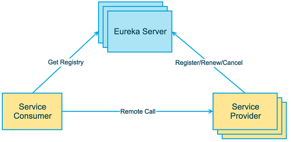

# Spring Cloud 微服务框架

## 1、三层框架：

* `表示层：` 用户使用应用程序时，看到的、听见的、输入的或者交互的部分。
* `业务逻辑层：` 根据用户输入的信息，进行逻辑计算或者业务处理的部分。
* `数据访问层：` 关注有效地操作原始数据的部分，如将数据存储到存储介质（如数据库、文件系统）及从存储介质中读取数据等。

## 2.微服务框架特性：

### 2.1 单一职责：

>微服务架构中的每个服务，都是具有业务逻辑的，符合高内聚、低耦合原则以及单一职责原则的单元，不同的服务通过“管道”的方式灵活组合，从而构建出庞大的系统。

### 2.2 轻量级通信：

>服务之间通过轻量级的通信机制实现互通互联，而所谓的轻量级，通常指语言无关、平台无关的交互方式。对于轻量级通信的格式而言，我们熟悉的 XML 和 JSON，它们是语言无关、平台无关的；

>
>对于通信的协议而言，通常基于 HTTP，能让服务间的通信变得标准化、无状态化。目前大家熟悉的 REST（Representational State Transfer）是实现服务间互相协作的轻量级通信机制之一。使用轻量级通信机制，可以让团队选择更适合的语言、工具或者平台来开发服务本身。

### 2.3  独立性：

>在单块架构中所有功能都在同一个代码库，功能的开发不具有独立性；当不同小组完成多个功能后，需要经过集成和回归测试，测试过程也不具有独立性；当测试完成后，应用被构建成一个包，如果某个功能存在 bug，将导致整个部署失败或者回滚。

>
>在微服务架构中，每个服务都是独立的业务单元，与其他服务高度解耦，只需要改变当前服务本身，就可以完成独立的开发、测试和部署。

### 2.4. 进程隔离

>单块架构中，整个系统运行在同一个进程中，当应用进行部署时，必须停掉当前正在运行的应用，部署完成后再重启进程，无法做到独立部署。有时候我们会将重复的代码抽取出来封装成组件，在单块架构中，组件通常的形态叫做共享库（如 jar 包或者 DLL），但是当程序运行时，所有组件最终也会被加载到同一进程中运行。在微服务架构中，应用程序由多个服务组成，每个服务都是高度自治的独立业务实体，可以运行在独立的进程中，不同的服务能非常容易地部署到不同的主机上。

微服务设计的原则

1. 单一职责
2. 服务自治原则
3. 轻量级通讯原则
4. 微服务粒度
5. 微服务注册与发现

## 服务发现组件、服务提供方和服务消费方三者关系图

1. 各个微服务在启动时，将自己的网络地址等信息注册到服务发现组件中，服务发现组件会存储这些信息。
2. 服务消费者可从服务发现组件查询服务提供者的网络地址，并使用该地址调用服务提供者的接口。
3. 各个微服务与服务发现组件使用一定机制（例如心跳）通信。服务发现组件如长时间无法与某微服务实例通信，就会注销该实例。

