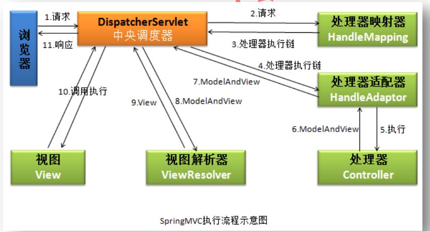

# SpringMVC

## SpringMVC的工作流程

1. 用户发起请求到前端控制器（DispatcherServlet），该控制器会过滤出哪些请求可以访问Servlet、哪些不能访问。就是url-pattern的作用，并且会加载springmvc.xml配置文件。
2. 前端控制器会找到处理器映射器（HandlerMapping），通过HandlerMapping完成url到controller映射的组件，简单来说，就是将在springmvc.xml中配置的或者注解的url与对应的处理类找到并进行存储，用map<url,handler>这样的方式来存储。
3. HandlerMapping有了映射关系，并且找到url对应的处理器，HandlerMapping就会将其处理器（Handler）返回，在返回前，会加上很多拦截器。
4. DispatcherServlet拿到Handler后，找到HandlerAdapter（处理器适配器），通过它来访问处理器，并执行处理器。
5. 执行处理器
6. 处理器会返回一个ModelAndView对象给HandlerAdapter
7. 通过HandlerAdapter将ModelAndView对象返回给前端控制器(DispatcherServlet)
8. 前端控制器请求视图解析器(ViewResolver)去进行视图解析，根据逻辑视图名解析成真正的视图(jsp)，其实就是将ModelAndView对象中存放视图的名称进行查找，找到对应的页面形成视图对象
9. 返回视图对象到前端控制器。
10. 视图渲染，就是将ModelAndView对象中的数据放到request域中，用来让页面加载数据的。
11. 通过第8步，通过名称找到了对应的页面，通过第10步，request域中有了所需要的数据，那么就能够进行视图渲染了。最后将其返回即可。