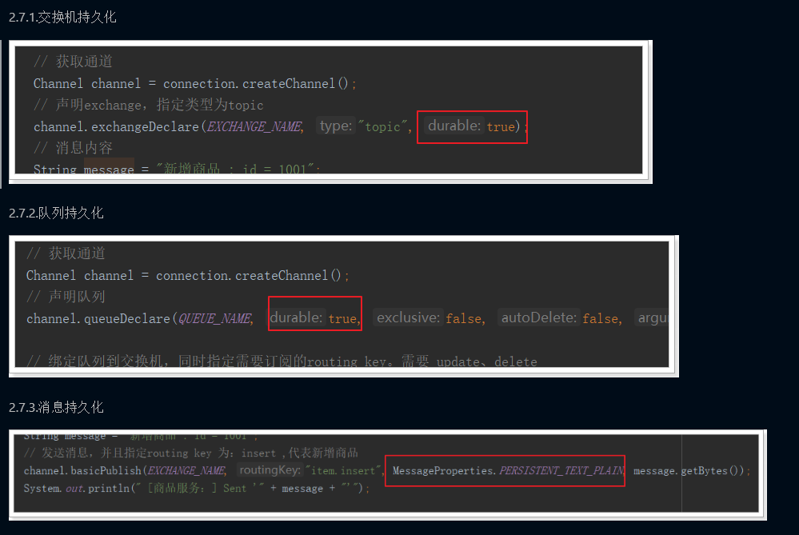

# RabbitMQ

## 消息队列

>消息队列，即MQ，Message Queue。消息队列是典型的：生产者、消费者模型。生产者不断向消息队列中生产消息，消费者不断的从队列中获取消息。因为消息的生产和消费都是异步的，而且只关心消息的发送和接收，没有业务逻辑的侵入，这样就实现了生产者和消费者的解耦。

## 安装RabbitMQ

### 1. 安装Erlang

```shell
    yum install esl-erlang_17.3-1~centos~6_amd64.rpm
    yum install erlang
```

### 2. 安装RabbitMQ

- 解压文件

```sh
    rpm -ivh rabbitmq-server-3.4.1-1.noarch.rpm
```

- 修改配置信息

```sh
    cp /usr/share/doc/rabbitmq-server-3.4.1/rabbitmq.config.example /etc/rabbitmq/rabbitmq.config
```

```config
    {loopback_users,[]}
```

- **注意要去掉后面的逗号**

### 3.启动应用

- service rabbitmq-server start  启动
- service rabbitmq-server stop  关闭
- service rabbitmq-server restart  重启

### 4. 设置开机启动

```sh
    chkconfig rabbitmq-server on
```

## 消息队列的五种消息模式


### 基本消息模型

- P（producer/ publisher）：生产者，一个发送消息的用户应用程序。

- C（consumer）：消费者，消费和接收有类似的意思，消费者是一个主要用来等待接收消息的用户应用程序

#### 生产者发送消息

```java

    public class Send {

    private final static String QUEUE_NAME = "simple_queue";

    public static void main(String[] argv) throws Exception {
        // 获取到连接以及mq通道
        Connection connection = ConnectionUtil.getConnection();
        // 从连接中创建通道，这是完成大部分API的地方。
        Channel channel = connection.createChannel();

        // 声明（创建）队列，必须声明队列才能够发送消息，我们可以把消息发送到队列中。
        // 声明一个队列是幂等的 - 只有当它不存在时才会被创建
        channel.queueDeclare(QUEUE_NAME, false, false, false, null);

        // 消息内容
        String message = "Hello World!";
        channel.basicPublish("", QUEUE_NAME, null, message.getBytes());
        System.out.println(" [x] Sent '" + message + "'");

        //关闭通道和连接
        channel.close();
        connection.close();
    }
}

```

### **消息确认机制（ACK）**

因此，RabbitMQ有一个ACK机制。当消费者获取消息后，会向RabbitMQ发送回执ACK，告知消息已经被接收。不过这种回执ACK分两种情况：

- 自动ACK：消息一旦被接收，消费者自动发送ACK

- 手动ACK：消息接收后，不会发送ACK，需要手动调用

#### 消费者获取消息(自动ACK)

```java

    public class Recv {
    private final static String QUEUE_NAME = "simple_queue";

    public static void main(String[] argv) throws Exception {
        // 获取到连接
        Connection connection = ConnectionUtil.getConnection();
        // 创建通道
        Channel channel = connection.createChannel();
        // 声明队列
        channel.queueDeclare(QUEUE_NAME, false, false, false, null);
        // 定义队列的消费者
        DefaultConsumer consumer = new DefaultConsumer(channel) {
            // 获取消息，并且处理，这个方法类似事件监听，如果有消息的时候，会被自动调用
            @Override
            public void handleDelivery(String consumerTag, Envelope envelope, BasicProperties properties,
                    byte[] body) throws IOException {
                // body 即消息体
                String msg = new String(body);
                System.out.println(" [x] received : " + msg + "!");
            }
        };
        // 监听队列，第二个参数：是否自动进行消息确认。
        channel.basicConsume(QUEUE_NAME, true, consumer);
    }
}
```

#### 消费者获取消息(手动ACK)

```java

    public class Recv2 {
    private final static String QUEUE_NAME = "simple_queue";

    public static void main(String[] argv) throws Exception {
        // 获取到连接
        Connection connection = ConnectionUtil.getConnection();
        // 创建通道
        final Channel channel = connection.createChannel();
        // 声明队列
        channel.queueDeclare(QUEUE_NAME, false, false, false, null);
        // 定义队列的消费者
        DefaultConsumer consumer = new DefaultConsumer(channel) {
            // 获取消息，并且处理，这个方法类似事件监听，如果有消息的时候，会被自动调用
            @Override
            public void handleDelivery(String consumerTag, Envelope envelope, BasicProperties properties,
                    byte[] body) throws IOException {
                // body 即消息体
                String msg = new String(body);
                System.out.println(" [x] received : " + msg + "!");
                // 手动进行ACK
                channel.basicAck(envelope.getDeliveryTag(), false);
            }
        };
        // 监听队列，第二个参数false，手动进行ACK
        channel.basicConsume(QUEUE_NAME, false, consumer);
    }
}
```

### 工作（竞争）队列

>工作队列，又称任务队列。主要思想就是避免执行资源密集型任务时，必须等待它执行完成。相反我们稍后完成任务，我们将任务封装为消息并将其发送到队列。 在后台运行的工作进程将获取任务并最终执行作业。当你运行许多工人时，任务将在他们之间共享，但是一个消息只能被一个消费者获取。

#### 能者多劳

>消费越快的人，消费的越多。使用basicQos方法和prefetchCount = 1设置。 这告诉RabbitMQ一次不要向工作人员发送多于一条消息。 或者换句话说，不要向工作人员发送新消息，直到它处理并确认了前一个消息。 相反，它会将其分派给不是仍然忙碌的下一个工作人员

```java
    public class Recv {
    private final static String QUEUE_NAME = "test_work_queue";

    public static void main(String[] argv) throws Exception {
        // 获取到连接
        Connection connection = ConnectionUtil.getConnection();
        // 获取通道
        final Channel channel = connection.createChannel();
        // 声明队列
        channel.queueDeclare(QUEUE_NAME, false, false, false, null);
        // 设置每个消费者同时只能处理一条消息
        channel.basicQos(1);
        // 定义队列的消费者
        DefaultConsumer consumer = new DefaultConsumer(channel) {
            // 获取消息，并且处理，这个方法类似事件监听，如果有消息的时候，会被自动调用
            @Override
            public void handleDelivery(String consumerTag, Envelope envelope, BasicProperties properties,
                    byte[] body) throws IOException {
                // body 即消息体
                String msg = new String(body);
                System.out.println(" [消费者1] received : " + msg + "!");
                try {
                    // 模拟完成任务的耗时：1000ms
                    Thread.sleep(1000);
                } catch (InterruptedException e) {
                }
                // 手动ACK
                channel.basicAck(envelope.getDeliveryTag(), false);
            }
        };
        // 监听队列。
        channel.basicConsume(QUEUE_NAME, false, consumer);
    }
}
```

### 订阅模型

#### 相关理解

1. 1个生产者，多个消费者

2. 每一个消费者都有自己的一个队列

3. 生产者没有将消息直接发送到队列，而是发送到了交换机

4. 每个队列都要绑定到交换机

5. 生产者发送的消息，经过交换机到达队列，实现一个消息被多个消费者获取的目的

X（Exchanges）：交换机一方面：接收生产者发送的消息。另一方面：知道如何处理消息，例如递交给某个特别队列、递交给所有队列、或是将消息丢弃。到底如何操作，取决于Exchange的类型。

### **Exchange类型**

- Fanout：广播，将消息交给所有绑定到交换机的队列
- Direct：定向，把消息交给符合指定routing key 的队列
- Topic：通配符，把消息交给符合routing pattern（路由模式） 的队列

#### *Fanout 广播模式*

- 1） 可以有多个消费者
- 2） 每个消费者有自己的queue（队列）
- 3） 每个队列都要绑定到Exchange（交换机）
- 4） 生产者发送的消息，只能发送到交换机，交换机来决定要发给哪个队列，生产者无法决定。
- 5） 交换机把消息发送给绑定过的所有队列
- 6） 队列的消费者都能拿到消息。实现一条消息被多个消费者消费

#### 生产者发送信息

```java

    public class Send {

    private final static String EXCHANGE_NAME = "fanout_exchange_test";

    public static void main(String[] argv) throws Exception {
        // 获取到连接
        Connection connection = ConnectionUtil.getConnection();
        // 获取通道
        Channel channel = connection.createChannel();

        // 声明exchange，指定类型为fanout
        channel.exchangeDeclare(EXCHANGE_NAME, "fanout");

        // 消息内容
        String message = "Hello everyone";
        // 发布消息到Exchange
        channel.basicPublish(EXCHANGE_NAME, "", null, message.getBytes());
        System.out.println(" [生产者] Sent '" + message + "'");

        channel.close();
        connection.close();
    }
}

```

#### 消费者接受消息

```java

public class Recv {
    private final static String QUEUE_NAME = "fanout_exchange_queue_1";

    private final static String EXCHANGE_NAME = "fanout_exchange_test";

    public static void main(String[] argv) throws Exception {
        // 获取到连接
        Connection connection = ConnectionUtil.getConnection();
        // 获取通道
        Channel channel = connection.createChannel();
        // 声明队列
        channel.queueDeclare(QUEUE_NAME, false, false, false, null);

        // 绑定队列到交换机
        channel.queueBind(QUEUE_NAME, EXCHANGE_NAME, "");

        // 定义队列的消费者
        DefaultConsumer consumer = new DefaultConsumer(channel) {
            // 获取消息，并且处理，这个方法类似事件监听，如果有消息的时候，会被自动调用
            @Override
            public void handleDelivery(String consumerTag, Envelope envelope, BasicProperties properties,
                    byte[] body) throws IOException {
                // body 即消息体
                String msg = new String(body);
                System.out.println(" [消费者1] received : " + msg + "!");
            }
        };
        // 监听队列，自动返回完成
        channel.basicConsume(QUEUE_NAME, true, consumer);
    }
}

```

### *Direct 指派模式*

P：生产者，向Exchange发送消息，发送消息时，会指定一个routing key。

X：Exchange（交换机），接收生产者的消息，然后把消息递交给 与routing key完全匹配的队列

C1：消费者，其所在队列指定了需要routing key 为 error 的消息

C2：消费者，其所在队列指定了需要routing key 为 info、error、warning 的消息

#### 生产者

```java

public class Send {
    private final static String EXCHANGE_NAME = "direct_exchange_test";

    public static void main(String[] argv) throws Exception {
        // 获取到连接
        Connection connection = ConnectionUtil.getConnection();
        // 获取通道
        Channel channel = connection.createChannel();
        // 声明exchange，指定类型为direct
        channel.exchangeDeclare(EXCHANGE_NAME, "direct");
        // 消息内容
        String message = "商品新增了， id = 1001";
        // 发送消息，并且指定routing key 为：insert ,代表新增商品
        channel.basicPublish(EXCHANGE_NAME, "insert", null, message.getBytes());
        System.out.println(" [商品服务：] Sent '" + message + "'");

        channel.close();
        connection.close();
    }
}
```

#### 消费者 - 1

```java

public class Recv {
    private final static String QUEUE_NAME = "direct_exchange_queue_1";
    private final static String EXCHANGE_NAME = "direct_exchange_test";

    public static void main(String[] argv) throws Exception {
        // 获取到连接
        Connection connection = ConnectionUtil.getConnection();
        // 获取通道
        Channel channel = connection.createChannel();
        // 声明队列
        channel.queueDeclare(QUEUE_NAME, false, false, false, null);

        // 绑定队列到交换机，同时指定需要订阅的routing key。假设此处需要update和delete消息
        channel.queueBind(QUEUE_NAME, EXCHANGE_NAME, "update");
        channel.queueBind(QUEUE_NAME, EXCHANGE_NAME, "delete");

        // 定义队列的消费者
        DefaultConsumer consumer = new DefaultConsumer(channel) {
            // 获取消息，并且处理，这个方法类似事件监听，如果有消息的时候，会被自动调用
            @Override
            public void handleDelivery(String consumerTag, Envelope envelope, BasicProperties properties,
                    byte[] body) throws IOException {
                // body 即消息体
                String msg = new String(body);
                System.out.println(" [消费者1] received : " + msg + "!");
            }
        };
        // 监听队列，自动ACK
        channel.basicConsume(QUEUE_NAME, true, consumer);
    }
}

```

#### 生产者 - 2

```java

public class Recv2 {
    private final static String QUEUE_NAME = "direct_exchange_queue_2";
    private final static String EXCHANGE_NAME = "direct_exchange_test";

    public static void main(String[] argv) throws Exception {
        // 获取到连接
        Connection connection = ConnectionUtil.getConnection();
        // 获取通道
        Channel channel = connection.createChannel();
        // 声明队列
        channel.queueDeclare(QUEUE_NAME, false, false, false, null);

        // 绑定队列到交换机，同时指定需要订阅的routing key。订阅 insert、update、delete
        channel.queueBind(QUEUE_NAME, EXCHANGE_NAME, "insert");
        channel.queueBind(QUEUE_NAME, EXCHANGE_NAME, "update");
        channel.queueBind(QUEUE_NAME, EXCHANGE_NAME, "delete");

        // 定义队列的消费者
        DefaultConsumer consumer = new DefaultConsumer(channel) {
            // 获取消息，并且处理，这个方法类似事件监听，如果有消息的时候，会被自动调用
            @Override
            public void handleDelivery(String consumerTag, Envelope envelope, BasicProperties properties,
                    byte[] body) throws IOException {
                // body 即消息体
                String msg = new String(body);
                System.out.println(" [消费者2] received : " + msg + "!");
            }
        };
        // 监听队列，自动ACK
        channel.basicConsume(QUEUE_NAME, true, consumer);
    }
}

```

### *Topic 通配符模式*

>Topic类型的Exchange与Direct相比，都是可以根据RoutingKey把消息路由到不同的队列。只不过Topic类型Exchange可以让队列在绑定Routing key 的时候使用通配符！

通配符规则：

​ #：匹配一个或多个词

​ *：匹配不多不少恰好1个词

### 数据持久化



## Spring AMOP

>​ Spring-amqp是对AMQP协议的抽象实现，而spring-rabbit 是对协议的具体实现，也是目前的唯一实现。底层使用的就是RabbitMQ。

### 依赖注入和配置

- 注入依赖

```xml
<dependency>
    <groupId>org.springframework.boot</groupId>
    <artifactId>spring-boot-starter-amqp</artifactId>
</dependency>
```

- 在application.yml中添加RabbitMQ的地址

```yml
    spring:
  rabbitmq:
    host: 192.168.28.128
    username: heb
    password: heb123654
    virtual-host: /heb
```

### AmqpTemplate

>Spring为AMQP提供了统一的消息处理模板：AmqpTemplate，非常方便的发送消息，其发送方法：

```java

    this.amqpTemplate.convertAndSend(EXCHANGE_NAME,"item",message);
```
