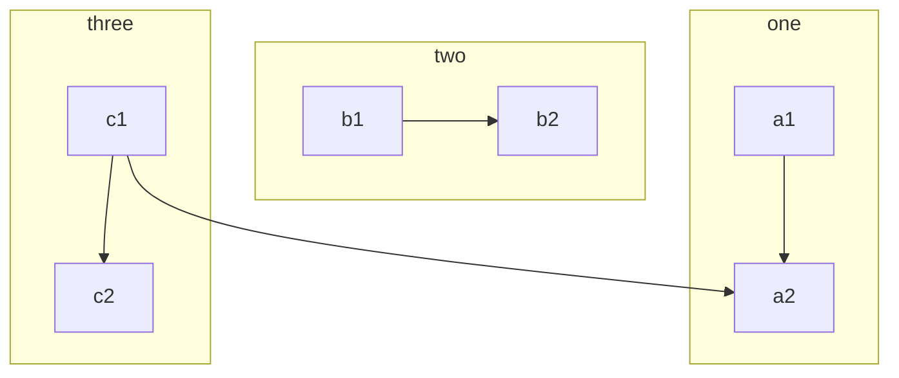
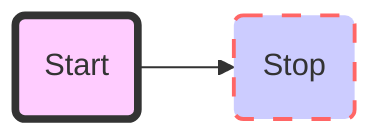
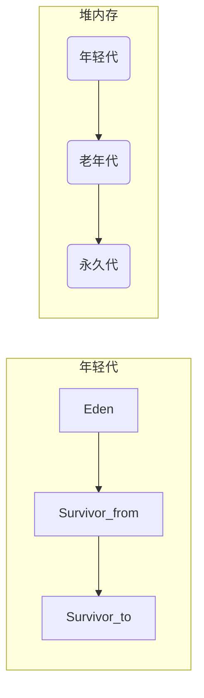

# 这是一级标题

## 这是二级标题

### 这是三级标题

#### 这是四级标题

##### 这是五级标题

###### 这是六级标题

*斜体*
**粗体**
***加粗斜体***
~~加删除线~~
>这是引用的内容

---

分割线

---

## 链接

[百度](http://ww.baidu.com)


## 列表

- 列表内容
  
- 列表内容
  
- 列表内容
  
表头|表头|表头
---|:--:|---:
内容|内容|内容
内容|内容|内容

$$
x \href{why-equal.html}{=} y^2 + 1
$$

$$
x = {-b \pm \sqrt{b^2-4ac} \over 2a}
$$

```java
public static void main(String[] arg){

}
```

### 快捷键  (取决于编辑器)

- 加粗 Ctrl + B
- 引用 Ctrl + Q
- 插入链接 Ctrl + L
- 插入代码 Ctrl + K
- 插入图片 Ctrl + G
- 提升标题 Ctrl + H
- 有序列表 Ctrl + O
- 无序列表 Ctrl + U
- 横线 Ctrl + R
- 撤销 Ctrl + Z
- 重做 Ctrl + Y

[^Hello]: dsdx

### Markdown 转 PDF

> - 安装插件:Markdown PDF
>
> - settings.json配置执行路径:"markdown-pdf.executablePath": "C:\\Program Files (x86)\\Google\\Chrome\\Application\\chrome.exe"

### Markdown 支持流程图

#### 安装插件：

  > Markdown Preview Mermaid Support

#### 相关的语法

- 控制方向
  - TB 从上到下
  - BT 从下到上
  - RL 从右到左
  - LR 从左到右
  - TD 同TB

- 基本图形
  - id + [文字描述]矩形
  - id + (文字描述)圆角矩形
  - id + >文字描述]不对称的矩形
  - id + {文字描述}菱形
  - id + ((文字描述))圆形
  
- 节点之间的连接
  |方法|描述|
  |--|--|
   A --> B|A带箭头指向B
   A --- B|A不带箭头指向B
   A -.- B|A用虚线指向B
   A -.-> B|A用带箭头的虚线指向B
   A ==> B|A用加粗的箭头指向B
   A -- 描述 --- B|A不带箭头指向B并在中间加上文字描述
   A -- 描述 --> B|A带箭头指向B并在中间加上文字描述
   A -. 描述 .-> B|A用带箭头的虚线指向B并在中间加上文字描述
   A == 描述 ==> B|A用加粗的箭头指向B并在中间加上文字描述

- 子流程
  


- 自定义样式
  - style id 具体样式
  


