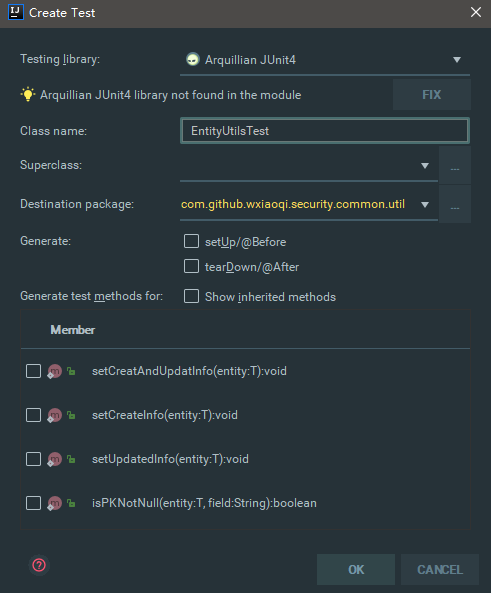
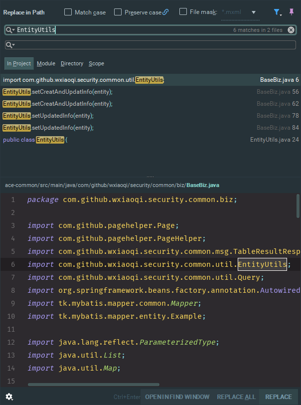

# 快捷键

## 创建测试类

- Ctrl + Shift + T

>弹出交互窗口后，编辑类名称、选择需要测试的方法

## 搜索

### 全文搜索

- Ctrl + Shift + F

>在路径中查找

### 当前文件下搜索

- Ctrl + F
  - F3
  >查找下一个
  - Shift + F3
  >查找上一个

## 方法引用

- Ctrl + F7
  >可以查询当前元素在当前文件中的引用，然后按 F3 可以选择

- Alt + F7
  >在路径中查找用法的使用者

## 折叠

- Ctrl + ”+/-”
  >当前方法展开、折叠
  
- Ctrl + Shift + ”+/-”
  >全部展开、折叠