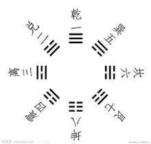

# 易经

## 爻

爻是组成卦符的基本符号

## 八卦

乾代表天
坤代表地
巽（xùn）代表风
震代表雷
坎代表水
离代表火
艮（gèn）代表山
兑代表泽

## 乾卦

### 卦辞：元、亨、利、贞

### 乾卦爻辞

初九: 潜龙勿用

九二：见龙在天，利见大人

九三：君子终日乾乾，夕惕若，厉，无咎

九四：或跃在渊，无咎

九五：飞龙在天，利见大人

九六：亢龙有悔

## 坤卦

### 卦辞：元亨，利牝马之贞

### 坤卦爻辞

初六：履霜坚冰至  （防患于未然）

六二：直方大，不习，无不利

六三： 含章可贞，或从王事，无成有终

六四： 括囊。无咎无誉 （谨言慎行）

六五： 黄棠元吉

上六： 龙战于野，其血玄黄

## 屯（zhun）卦  震+坎

## 卦象：云雷屯，君子以经论

### 卦辞：元、亨、利、贞，勿动有攸往，利建侯

### 屯卦爻辞

初九：盘桓，利居贞，利建侯

六二：屯如，邅如，乘马班如。匪寇，婚媾。女子贞不字，十年乃字。

六三：即鹿无虞，惟入于林中；君子几不如舍。往吝。

六四：乘马班如，求婚媾；往吉，无不利。

九五：屯其膏，小贞吉，大贞凶。

上六：乘马班如，泣血涟如。

## 蒙卦 艮 + 坎 山水蒙

### 卦辞：亨，匪我求童蒙，童蒙求我（教化的基本原理）。初筮告，再三渎，渎则不告。利贞

人之患，在好为人师

### 蒙卦爻辞

初六：发蒙，利用刑（型）人，用说桎梏，以往吝。

九二：包蒙，吉。纳妇，吉；子克家。

六三：勿用取女，见金夫，不有躬，不筱利。

六四：困蒙，吝

六五：童蒙，吉。

上九：击蒙。不利为寇，利御寇。（合理的体罚）

责之深，爱之切。

## 需卦 坎 + 乾  守时待命   时也，命也

人要节制自己的欲望 既不纵欲，也不禁欲

需要等待

### 卦辞：有孚，光亨，贞吉，利涉大川

### 需卦爻辞

初九：需于郊，利用恒，无咎  （要有恒心）

九二：需于沙，小有言，终吉。

九三：需于泥，致寇至。

六四：需于雪，出于穴

九五：需于酒食，贞吉  （分享）

上六：入于穴，有不速之客三人来，敬之，终吉。

## 讼卦   天水讼

### 卦辞：有孚窒惕，中吉，终凶。利见大人，不利涉大川

### 卦象：天水违行，讼。君子以做事某始

### 讼卦爻辞

初六：不永所事，小有言，终吉

九二：不克讼，归需逋，其邑人三百户，无眚

六三：食旧德，贞，厉，终吉，或从王事，无成

九四：不克讼，复即命渝，安贞，吉

九五：讼，元吉

上六：或锡之鞶带，终朝三褫之

## 师卦  地水师

