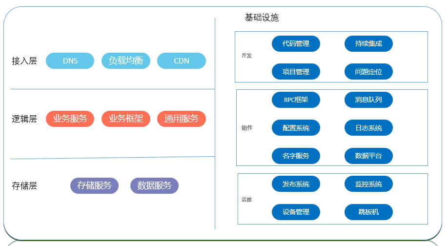

# 项目搭建

## 后台技术栈

### 开发语言

- Java
- Python
- Go

### 项目框架

- Spring Boot
- Spring Cloud

### 消息中间件

>消息队列

***kafka***

### 权限管理

***Shiro***

### 代码管理

***Git***

### 持久化集成

***Jenkins***

### 模板引擎

***Beetl***

- 相关链接

>[官网](http://ibeetl.com/)

### 日志系统

***EL(F)K***

- *ElasticSearch* 是个开源分布式搜索引擎，它的特点有：分布式，零配置，自动发现，索引自动分片，索引副本机制，restful风格接口，多数据源，自动搜索负载等。
- *Logstash* 是一个完全开源的工具，它可以对你的日志进行收集、分析，并将其存储供以后使用。
- *Kibana* 是一个开源和免费的工具，它可以为 Logstash 和 ElasticSearch 提供的日志分析友好的 Web 界面，可以帮助汇总、分析和搜索重要数据日志。
- *Filebeat* 已经完全替代了 Logstash-Forwarder 成为新一代的日志采集器，同时鉴于它轻量、安全等特点，越来越多人开始使用它。
  
### 监控系统

- 操作系统发监控
- 服务和业务质量监控和

### 配置系统

### 发布/部署系统

- Docker