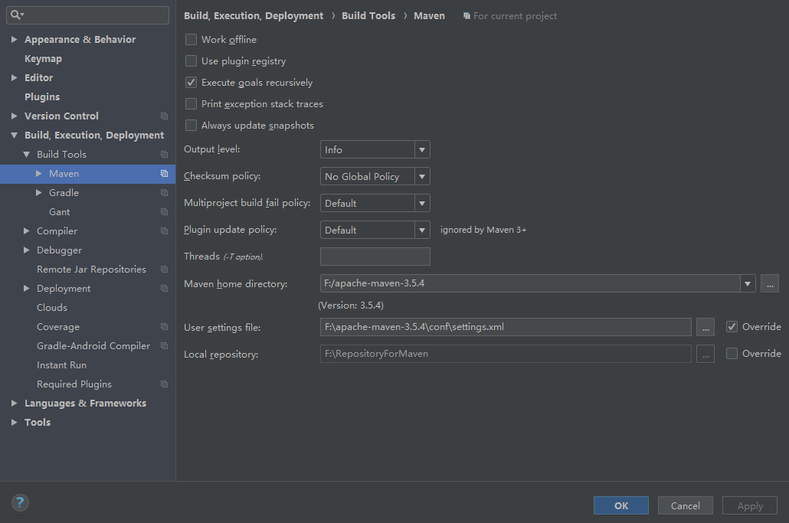

## Maven配置
### 一、下载Maven
---
***[Maven官网](http://maven.apache.org/download.cgi)***  
### 二、Maven配置
---  
1. 配置本地仓库  
   在apache-maven-3.5.4\conf\setting.xml中添加如下信息：  
   ``<localRepository>F:\RepositoryForMaven</localRepository>``
### 三、IDEA配置Maven
---   
1. File | Settings | Build, Execution, Deployment | Build Tools | Maven 
    
     

				
				

 